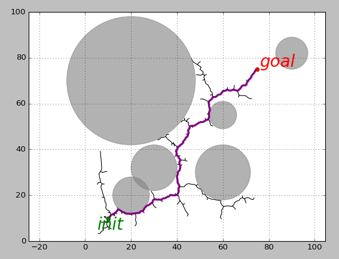

## RRT Path Planning
#### _Miaoding Dai_ (<m.dai@u.northwestern.edu>)

### Brief Introduction of RRT

A Rapidly-Exploring Random Tree (RRT) is one of the most important tools used in robotic path planning. RRTs were first developed in 1998 by Steve LaValle at Iowa State. Dr. Lavalle is now a professor at UIUC, and was one of the inventors of the Oculus Rift. In the simplest of terms, an RRT is an algorithm that guarantees rapid exploration of some vector space.

> Reference: [RRT Wikipedia Page](https://en.wikipedia.org/wiki/Rapidly-exploring_random_tree)

### Description of This Practice

In this practice, I am going to actually accomplish some path planning. Firstly, I set a starting location and a goal location, together with some circular collision objects (for testing convenience, which can be easily changed to random distributed ones).

Then, the algorithm will only add nodes to the tree if they have collision free path to the nearest neighbor, and as we expand the tree we will check if there is a collision free path to the goal. Once we have a collision free path to the goal, we can reconstruct the path by following the tree back to the starting location.

After finishing RRT path planning, my code will generate a plot with the following items:
1. The clearly visible circles representing collision objects.
2. The tree that the RRT expanded.
3. The starting and goal locations.
4. The path used by the RRT to go from the starting location to the goal location.

One plot can be seen as below,

